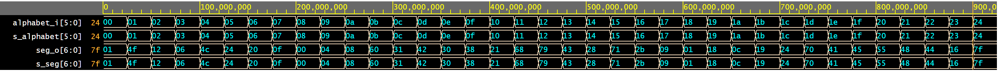
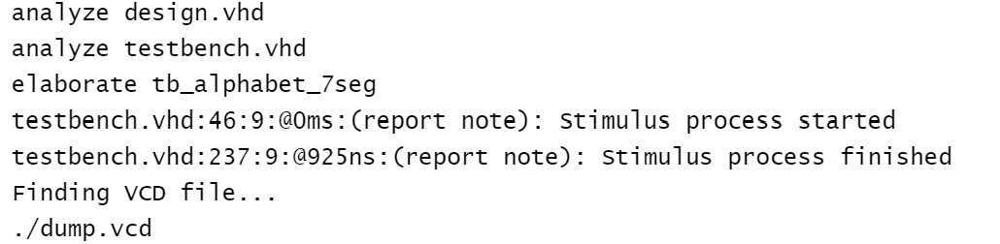

# alphabet_7seg.vhd notes

0.  Component in/out:

    entity alphabet_7seg is
        port(
            alphabet_i : in  std_logic_vector(6 - 1 downto 0);
            seg_o : out std_logic_vector(7 - 1 downto 0)
        );
    end entity alphabet_7seg;

1.  Component can transcode maximum of 64 (2^6) characters according to following table, to a 7 segment common anode display.

   
   > The image above was used from website: [How Seven Segment Display Works & Interface it with Arduino](https://lastminuteengineers.com/seven-segment-arduino-tutorial/).
   >

   
   > The image above was used from website: [Longest Seven Segment Word](https://codegolf.stackexchange.com/questions/173837/longest-seven-segment-word).
   >

    Completed decoder truth table for **common anode** 7-segment display.

   | **Character** | **Inputs** | **A** | **B** | **C** | **D** | **E** | **F** | **G** |
   | :-: | :-: | :-: | :-: | :-: | :-: | :-: | :-: | :-: |
   | 0 | 000000 | 0 | 0 | 0 | 0 | 0 | 0 | 1 |
   | 1 | 000001 | 1 | 0 | 0 | 1 | 1 | 1 | 1 |
   | 2 | 000010 | 0 | 0 | 1 | 0 | 0 | 1 | 0 |
   | 3 | 000011 | 0 | 0 | 0 | 0 | 0 | 1 | 1 |
   | 4 | 000100 | 1 | 0 | 0 | 1 | 1 | 0 | 0 |
   | 5 | 000101 | 0 | 1 | 0 | 0 | 1 | 0 | 0 |
   | 6 | 000110 | 0 | 1 | 0 | 0 | 0 | 0 | 0 |
   | 7 | 000111 | 0 | 0 | 0 | 1 | 1 | 1 | 1 |
   | 8 | 001000 | 0 | 0 | 0 | 0 | 0 | 0 | 0 |
   | 9 | 001001 | 0 | 0 | 0 | 0 | 1 | 0 | 0 |
   | A | 001010 | 0 | 0 | 0 | 1 | 0 | 0 | 0 |
   | b | 001011 | 1 | 1 | 0 | 0 | 0 | 0 | 0 |
   | C | 001100 | 0 | 1 | 1 | 0 | 0 | 0 | 1 |
   | d | 001101 | 1 | 0 | 0 | 0 | 0 | 1 | 0 |
   | E | 001110 | 0 | 1 | 1 | 0 | 0 | 0 | 0 |
   | F | 001111 | 0 | 1 | 1 | 1 | 0 | 0 | 0 |
   | G | 010000 | 0 | 1 | 0 | 0 | 0 | 0 | 1 |
   | h | 010001 | 1 | 1 | 0 | 1 | 0 | 0 | 0 |
   | I | 010010 | 1 | 1 | 1 | 1 | 0 | 0 | 1 |
   | J | 010011 | 1 | 0 | 0 | 0 | 0 | 1 | 1 |
   | k | 010100 | 0 | 1 | 0 | 1 | 0 | 0 | 0 |
   | L | 010101 | 1 | 1 | 1 | 0 | 0 | 0 | 1 |
   | M | 010110 | 0 | 1 | 0 | 1 | 0 | 1 | 1 |
   | n | 010111 | 0 | 0 | 0 | 1 | 0 | 0 | 1 |
   | O | 011000 | 0 | 0 | 0 | 0 | 0 | 0 | 1 |
   | P | 011001 | 0 | 0 | 1 | 1 | 0 | 0 | 0 |
   | q | 011010 | 0 | 0 | 0 | 1 | 1 | 0 | 0 |
   | r | 011011 | 0 | 0 | 1 | 1 | 0 | 0 | 1 |
   | S | 011100 | 0 | 1 | 0 | 0 | 1 | 0 | 0 |
   | t | 011101 | 1 | 1 | 1 | 0 | 0 | 0 | 0 |
   | U | 011110 | 1 | 0 | 0 | 0 | 0 | 0 | 1 |
   | v | 011111 | 1 | 0 | 0 | 0 | 1 | 0 | 1 |
   | w | 100000 | 1 | 0 | 1 | 0 | 1 | 0 | 1 |
   | X | 100001 | 1 | 0 | 0 | 1 | 0 | 0 | 0 |
   | y | 100010 | 1 | 0 | 0 | 0 | 1 | 0 | 0 |
   | Z | 100011 | 0 | 0 | 1 | 0 | 1 | 1 | 0 |
   |   | 100100 | 1 | 1 | 1 | 1 | 1 | 1 | 1 |

2. Simulation, including reports.

   
   
   

3. Link to your public EDA Playground example:

   alphabet_7seg: [https://www.edaplayground.com/x/8ZXE](https://www.edaplayground.com/x/8ZXE)