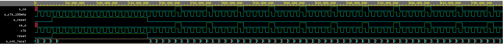

# clock_enable.vhd

0.  Component in/out:

```vhdl
    entity clock_enable is
    generic(
        g_MAX : natural := 10  -- Number of clk pulses to generate one enable signal period
    );

    port(
        clk   : in  std_logic; -- Main clock
        reset : in  std_logic; -- Synchronous reset
        ce_o  : out std_logic  -- Clock enable pulse signal
    );
end entity clock_enable;
```
1.  Component will send pulse every g_MAX pulses of Main clock
    
2. Simulation

   

3. Link to your public EDA Playground example:

   clock_enable: [https://www.edaplayground.com/x/JPh4](https://www.edaplayground.com/x/JPh4)
