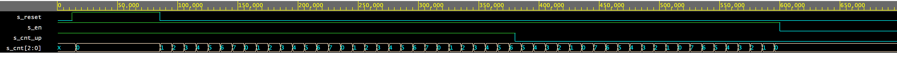

# cnt_up_down.vhd

0.  Component in/out:

```vhdl
entity cnt_up_down is
    generic(
        g_CNT_WIDTH : natural := 3 -- Number of bits for counter
    );
    port(
        clk      : in  std_logic;  -- Main clock
        reset    : in  std_logic;  -- Synchronous reset
        en_i     : in  std_logic;  -- Enable input
        cnt_up_i : in  std_logic;  -- Direction of the counter
        cnt_o    : out std_logic_vector(g_CNT_WIDTH - 1 downto 0)
    );
end entity cnt_up_down;
```
1.  Component counts clk pulses up to g_CNT_WIDTH (default = 3); can count up or down, according to cnt_up

2. Simulation, including reports.

   

3. Link to your public EDA Playground example:

   alphabet_7seg: [https://www.edaplayground.com/x/KUFq](https://www.edaplayground.com/x/KUFq)
